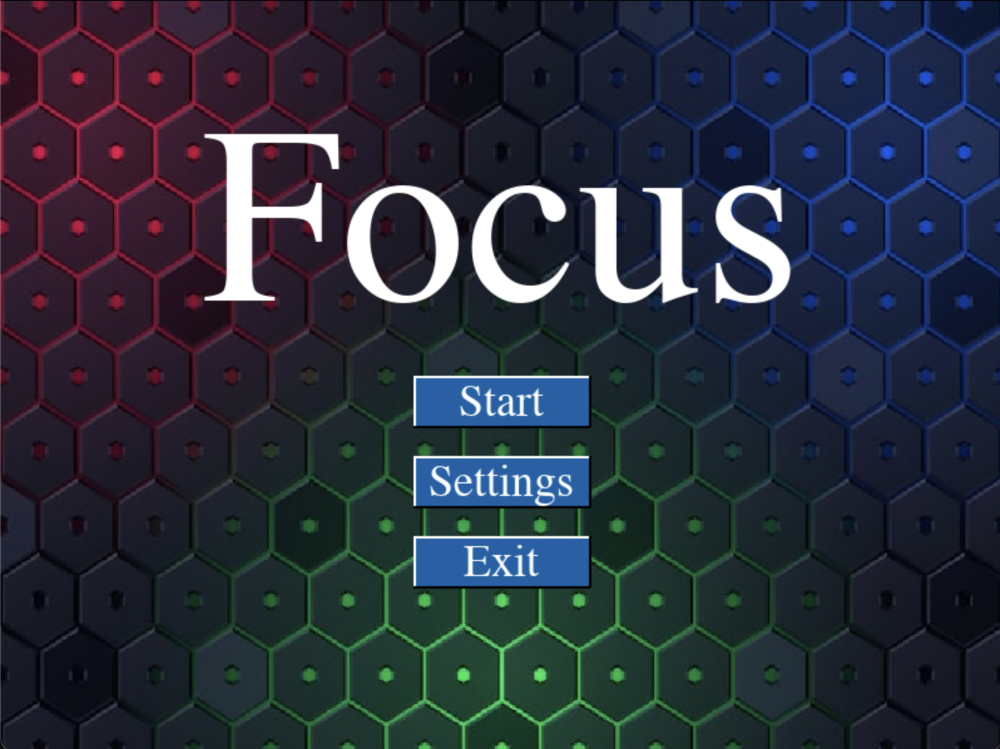
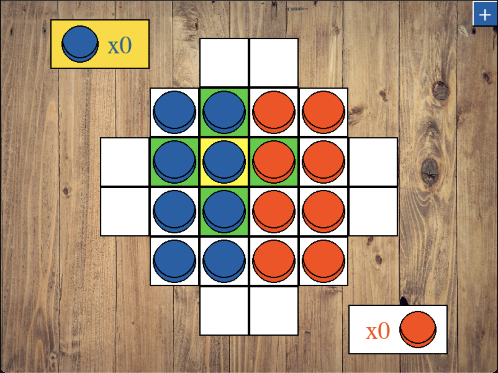
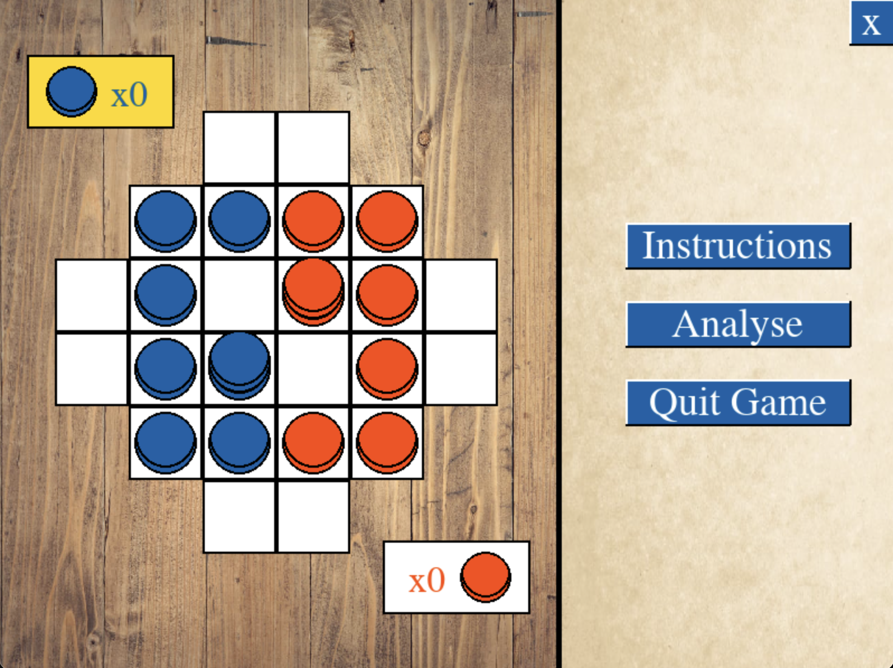

# Artificial intelligence

## FOCUS: Adversarial Search Methods for Two-Player Board Games

## Descrição do jogo

Focus is an abstract strategy board game. The game is for 2–4 players, and in this project, the board is designed with a variable size chosen by the user. The objective of the game is to leave the opponent with no valid moves. To achieve this, players move their pieces to form stacks, and the color of the piece at the top of the stack determines who can move it. Once all stacks belong to one player, the opponent is left with no valid moves

## Configuração

To run the game, Python version 3.10 or higher must be installed. The Pygame library is also required.
The command to start the game is:

```bash
python main.py
    ou
python3 main.py
```

## Utilização

The game has a main menu, and by clicking on "Settings," you can access secondary menus to configure the game. The available settings include player types (Human, Computer Easy Level, Computer Medium Level, Computer Hard Level), board size, and the number of players (from 2 to 4).



By clicking "Start" in the menu, you can begin the game. The rectangles outside the board indicate each player’s reserve pieces, and when filled in yellow, they show that it is that player’s turn. The "+" button opens the side panel.



Use the mouse to click on the piece you want to move, and the valid movement options will be displayed on the screen. Click on one of the options shown to make the move, or click outside the options to select another piece.  
For stacks, you need to use the "1," "2," "3," "4," and "5" keys on the keyboard to choose how many pieces from the stack you want to move, depending on how many pieces the stack has (moving the entire stack is the default).  
When playing as the computer, you need to press the "space" key on the keyboard for the computer to make its move.



With the side panel, you can access the game instructions, movement hints, and exit the game, returning to the main menu. To close the panel, you need to click the "X" button.  
The application window can be resized to any size the user desires.
